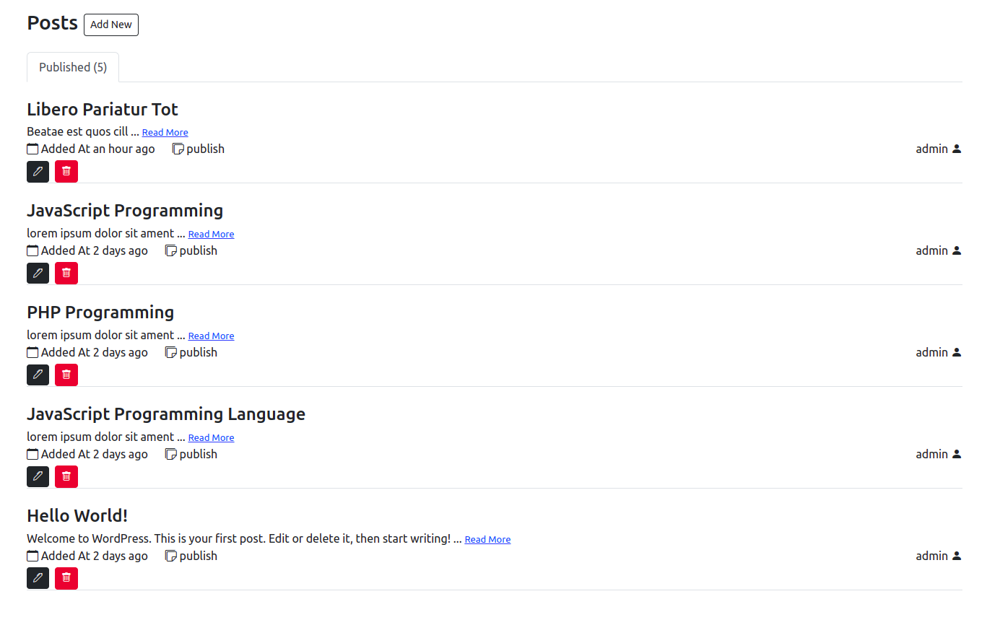

# wp-api

Create a Secure REST API with WordPress and VueJS
---
## Screenshots



---

The following must be installed and available on your terminal:

* [x] wordpress
* [x] JWT Authentication for WP-API Plugin
* [x] npm

---

Replace your own:
* token: your-unique-token
* url: your-wp-route

---

## Starting Project


1. repos clone
```composer
git clone https://github.com/soulaimaneyahya/wp-api.git
```

2. install npm and run
```npm
npm install
```
```npm
npm run dev
```

----- 
Need helps? Reach me out

> Email: soulaimaneyh07@gmail.com

> Linkedin: soulaimane-yahya

All the best :beer:
